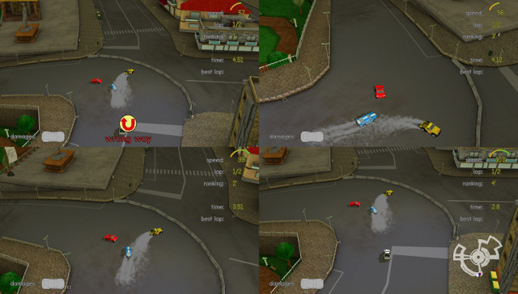

yorg
=========

**Yorg** is an *open source* racing game developed by Ya2 using [Panda3D](http://www.panda3d.org) for *Windows*, *OSX* and *Linux*. More information can be found on [this page](http://www.ya2.it/pages/yorg.html).

It requires *Python 3.x*. It should be cloned recursively since [yyagl submodule](https://github.com/cflavio/yyagl) is used.

To run it you should create assets:

* `scons images=1 lang=1 tracks=1`

To create a build, the target OS (`windows`, `osx`, `linux`) should be specified, e.g.:

* `scons linux=1`

Here's a short guide about installing and preparing your environment for Yorg.

* clone the repository: `git clone --recursive https://github.com/cflavio/yorg.git`
* go into the directory: `cd yorg`
* (optional, recommended for non-developers, since *master* is an unstable branch) checkout the *stable* branch: `git checkout stable; git submodule foreach git checkout stable`
* create a python3 virtualenv: `virtualenv --python=/usr/bin/python3 venv`
* activate the virtualenv: `. ./venv/bin/activate`
* install the prerequisites: `pip install panda3d SCons psutil bson pyyaml feedparser`
* build the required assets: `scons lang=1 images=1 tracks=1`
* launch the game: `python main.py`

Here's a screenshot:

